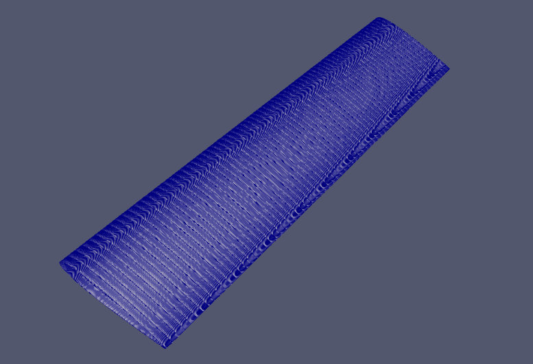
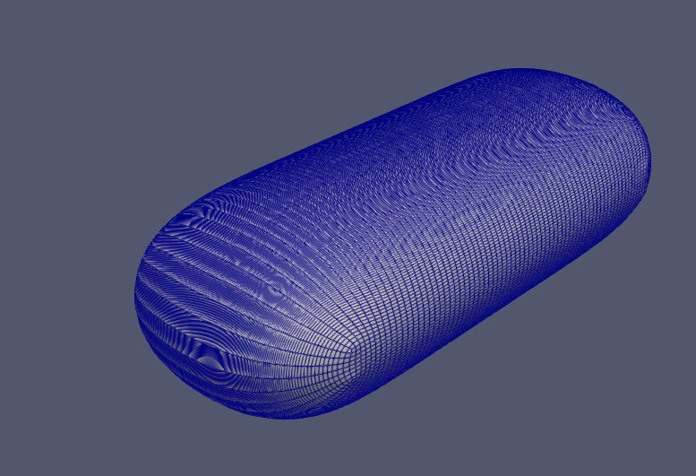
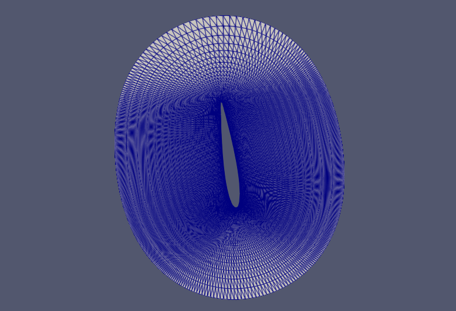
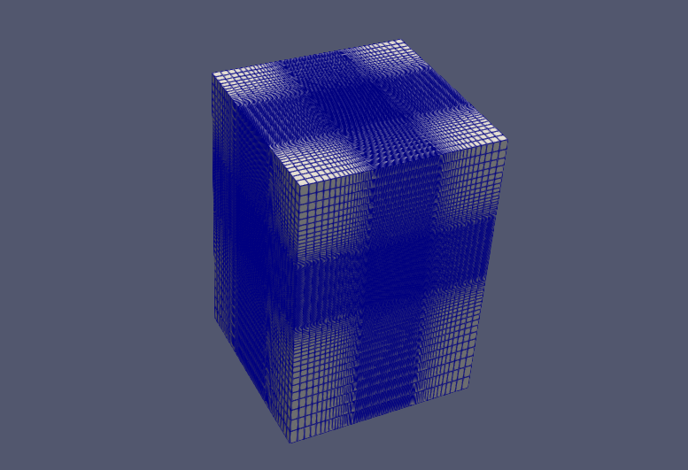

# pyhyp-rotor-overset-generator

[](https://doi.org/10.5281/zenodo.21257648)

Structured overset (chimera) mesh generation for rotors with
[pyHyp](https://github.com/mdolab/pyhyp): a wall-resolved (y+ ≈ 1)
boundary-layer **blade component mesh** from a plain-text per-section
planform table, full-rotor replication, and a matching structured Cartesian
**background mesh** with a rotor refinement box.

The output is plain formatted **PLOT3D**, so the mesh is solver-agnostic:
convert/import it into OpenFOAM, SU2, CGNS-based codes, or use it as the
near-body component of an overset (chimera) setup.

```
rotor.dat ──▶ blade_surface.py ──▶ skin.fmt ──▶ march.py (pyHyp) ──▶ bladeVol.xyz
               (closed sock,                     (hyperbolic BL,        │ nBlades > 1
                multiblock surface)               i = wall-normal)      ▼
                                                                   rotorVol.xyz
```

Caradonna-Tung example (ParaView):

| blade skin (single blade) | BL volume — closed sock |
|---|---|
|  |  |
| **section slice — O-grid, y+≈1 layers** | **Cartesian background — refinement box** |
|  |  |

One-shot (outputs land next to the input file):

```bash
PYHYP_PYTHON=<python-with-pyhyp> ./make_rotor.sh examples/rotor_sc1095/rotor_sc1095.dat
```

## Why

gmsh/snappy-style extruded prisms struggle to produce robust y+≈1 layers on
thin lifting surfaces (self-intersection at the TE, ~60° non-orthogonality
for tetrahedral BLs). A pyHyp hyperbolic march from a structured skin gives
orthogonal hexahedral layers (typically **~2° mean non-orthogonality**) with a
first-cell spacing you set directly in meters. The hard part — a watertight
("closed sock") surface topology that pyHyp accepts — is what this package
automates.

## Axis convention (rotor frame)

```
      -x  (suction side / thrust side)
        │
        │      y  (span, tip)
        │    ╱
        │   ╱
        └──╱─────────▶  z   (chordwise: the LE FACES -z, TE toward +z)

  x : rotor axis — rotor wake direction is +x
```

* **twist** is applied about the local **quarter chord (0.25 c)**;
  positive twist = nose-up (LE rotates toward −x)
* **LE_z** moves the leading edge fore/aft along +z (sweep), in **meters**,
  *before* the twist rotation
* volume output index order: **i = wall-normal** (i=1 on the wall),
  j = airfoil perimeter (TE_lower → LE → TE_upper → blunt-TE seal),
  k = span (root → tip, +y)

## Input file

One plain-text `.dat` file: keyword lines followed by a `SECTIONS` table
(`#` starts a comment). Examples are organised one folder per rotor, with
airfoil coordinate files in an `airfoil/` subfolder; generated meshes are
written into the rotor folder (and are git-ignored):

```
examples/
  rotor_sc1095/
    rotor_sc1095.dat        # this input file
    airfoil/sc1095.dat      # airfoil coordinates (paths relative to input)
    bladeSurf.fmt           # generated: single-blade skin
    bladeVol.xyz            # generated: single-blade volume
    rotorVol.xyz            # generated: full rotor (nBlades copies about +x)
    backgroundVol.xyz       # generated: structured overset background
    *_vtk.vtm               # generated: ParaView
```

```
nBlades    2            # full-rotor replication about +x (1 = single blade)
R          1.143        # tip radius [m]

nChord     200          # chordwise points per side
nTE        7            # blunt-TE seal interior points (must be ODD)
teCut      0.96         # TE truncation (x/c)
dTE_c      0.003        # chordwise spacing at the TE (x/c)
nSpan      70           # spanwise stations
closedSock 1

firstLayer 2.78e-6      # first wall spacing [m]  (y+ target)
nLayers    76
marchDist  0.19         # total march distance [m]

SECTIONS
# r/R    chord[m]   twist[deg]  LE_z[m]  airfoil
0.19     0.1905     8.0         0.0      naca0012
1.00     0.1905     8.0         0.0      naca0012
```

| column | meaning |
|---|---|
| `r/R` | span station y/R |
| `chord` | local chord [m] |
| `twist` | nose-up twist about the local 0.25c [deg] |
| `LE_z` | fore/aft LE position along +z, in METERS (sweep) |
| `airfoil` | `nacaXXXX` (4-digit) or path to a Selig-format `.dat` file |

Airfoil files: both **Selig** (one TE→LE→TE loop) and **Lednicer** (point
counts, then upper/lower LE→TE) formats are auto-detected, so files from the
[UIUC Airfoil Coordinates Database](https://m-selig.ae.illinois.edu/ads/coord_database.html)
work directly. Tabulated ordinates are resampled with a cubic spline in
√x (smooth nose) after `datSmooth` (default 5) endpoint-preserving Laplacian
passes — digitised data carries point-to-point noise that otherwise folds the
hyperbolic march. Paths are resolved relative to the input file.

Examples using airfoil files:
* `examples/rotor_23012/` — NACA 23012 (5-digit, generated analytically)
* `examples/rotor_sc1095/` — Sikorsky SC1095 (UH-60 section, downloaded from
  the UIUC database, Lednicer format)

Between stations chord/twist/LE_z vary linearly and airfoil ordinates are
blended linearly. Optional keywords: `dLE_c` (LE chordwise spacing),
`dRootFrac`/`dTipFrac` (spanwise tanh clustering), `rootCut`,
`splay`, `volSmoothIter`, `volBlend`, `cMax`, `epsE`, `epsI`, `theta`,
`nConstantStart`.

## Usage

```bash
# 1. surface (any python3 + numpy)
python3 blade_surface.py examples/caradonna_tung/caradonna_tung.dat skin.fmt

# 2. march (a python with pyHyp installed, e.g. the MDO-lab / DAFoam conda env)
<pyhyp-python> march.py examples/caradonna_tung/caradonna_tung.dat skin.fmt bladeVol.xyz

# 3. optional: ParaView-ready VTK (no VTK library required)
python3 to_vtk.py bladeVol.xyz          # -> bladeVol.vtm + bladeVol/block*.vts
```

`march.py` prints pyHyp's quality table; look for `Normals are consistent!`
and a positive `Min Quality`. The single-blade result is a 3-block PLOT3D
volume (main O-grid + tip cap + root cap) in the i=wall-normal ordering.
With `nBlades > 1` the single-blade volume is additionally replicated by
rotation about the rotor axis (+x) into `rotorVol.xyz` (nBlades x 3 blocks);
the SURFACE stays single-blade — only one blade is ever marched.

## Overset background mesh

`background_mesh.py` (also run by `make_rotor.sh`) builds a structured
single-block Cartesian background for overset assemblies from the same input:
a **refinement box** around the rotor with uniform spacing given in **tip
chords** (default `bgSpacing 0.15`), growing geometrically away from the box
(`bgGrowth`, default 1.12) out to the domain boundary.

```
bgSpacing  0.15         # refine-box spacing [tip chords]
bgGrowth   1.12         # spacing growth ratio outside the box
bgXmin -4   bgXmax 8    # domain extents [R]  (+x = wake/downstream)
bgYmin -4   bgYmax 4
bgZmin -4   bgZmax 4
refXmin -0.5  refXmax 2.0     # refinement box [R]: 0.5R upstream, 2R of
refYmin -1.2  refYmax 1.2     #  wake downstream, radius 1.2R
refZmin -1.2  refZmax 1.2
```

Mind the cell count for small tip chords: at `bgSpacing 0.15` a c_tip = 0.07 m
blade on R = 1 m gives ~15M background cells; the small-chord examples ship
with `bgSpacing 0.4` for compactness.

Note on the march log: the first few levels near the blunt-TE cap corners can
report `Min Quality -1` with tiny negative volumes — the march recovers within
~30 levels **provided the growth ratio stays moderate (~1.15)**. Very
aggressive tests (few layers over a large `marchDist`) collapse instead.

## Topology notes (the parts that are easy to get wrong)

* **Closed sock**: the skin is a watertight multiblock quilt — a main O-grid
  (i = perimeter, j = span) plus two **non-degenerate Coons-TFI caps**. pyHyp's
  normal check registers every quad's four *directed* edges and aborts on any
  repeat, so a cap with a collapsed edge (point/camber-line tip) can NEVER
  pass: each cap's four edges are exact point-subsets of the end perimeter
  (LE nose arc / lower surface / blunt-TE seal / upper surface), and the cap
  corners become 4-edge/3-face "LCorner" nodes, which pyHyp's marcher
  supports.
* **`nTE` must be odd** — the LE nose arc has `nTE+2` points placed
  symmetrically about the LE.
* **Chordwise spacing is a two-sided tanh** (Vinokur), not cosine: cosine
  clustering shrinks TE cells to ~1e-4 c, and the cap columns at the 90°
  blunt-TE corner then shear/invert during the march. Keep `dTE_c` comparable
  to the seal spacing (default 0.003) and let `dLE_c` default so the nose arc
  stays at nose-radius scale.
* **Blunt TE**: the TE is truncated at `teCut` and sealed with `nTE` points —
  a sharp TE folds the hyperbolic march.
* The outward orientation of the quilt is verified numerically at write time
  and all blocks are flipped together if needed, so the march direction is
  always out of the body.
* Set `closedSock 0` to fall back to a single open-ended block whose free
  span edges pyHyp splays (quick tests; span ends are then not meshed).
* **Known limitation** — cambered sections with large twist at the blade
  ENDS leave a small number of non-convex corner cells in the end-cap blocks
  near the LE (0 for symmetric sections; ~0.1% of cap cells for SC1095 at
  10° root twist). The march still completes with the usual final quality
  (~0.42); check whether your solver tolerates these cells, reduce the twist
  at the root station, or use `closedSock 0` if the span ends are not needed.

## Requirements

* python3 + numpy (surface generation, VTK export — any OS incl. Windows)
* [pyHyp](https://github.com/mdolab/pyhyp) (volume march only)

### Windows

`blade_surface.py` and `to_vtk.py` are pure python3+numpy and run natively on
Windows. pyHyp itself is Linux/macOS software, so run the march step under
**WSL2** (or a Docker image that ships pyHyp, e.g. the DAFoam/MDO-lab images);
`make_rotor.sh` is a bash script and runs as-is inside WSL. The generated
PLOT3D/VTK files are plain text and portable across OSes.

## Citation

If you use this software in your research, please cite it. GitHub's
*"Cite this repository"* button uses `CITATION.cff`; an archived, DOI-carrying
snapshot of each release is available via Zenodo:

[](https://doi.org/10.5281/zenodo.21257648)

```bibtex
@software{joo_pyhyp_rotor_overset_generator,
  author  = {Joo, Seunghyun},
  title   = {pyhyp-rotor-overset-generator: structured overset mesh
             generation for rotors with pyHyp},
  url     = {https://github.com/SEUNGHYUN-JOO/pyhyp-rotor-overset-generator},
  doi     = {10.5281/zenodo.21257648},
  license = {MIT}
}
```

## License

MIT (this package). pyHyp is a separate project by the MDO Lab, licensed under the Apache License 2.0 (http://www.apache.org/licenses/LICENSE-2.0); it is not bundled here — install it independently and comply with its license.
